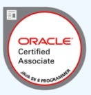

# Hey, I'm Prathima Joginipelly 
## Junior DevOps Consultant

## Certifications

            

## Summary

I am set on continuously expanding her technical and interpersonal skills. I determined to turn my passion for software and tech into a long-lasting and successful career. 

I have never been afraid of stepping out of her comfort zone to experience new things when it comes to her career or personal life. This mindset has allowed her to switch career from Test Analyst to DevOps Consultant by learning new skills like Python, Linux, and Virtualisation. I have gained experience in Agile methodology and exposed to various Software Development tools like Jenkins, Github and Flask.

I like to watch comedy movies with my family and likes to cook for friends and family at my leisure time.

## Work Experience

### April 2020 -May 2021
### IP Global Services - Test Analyst
I have gained the experience of test planning, providing effort and schedule estimation, laying down test strategies. I was also involved in designing framework for automated execution of test cases using TestNg, Selenium WebDriver & Grid and Maven. I have achieved cross browser and cross OS testing using Selenium Grid and Docker. I have gained the experience of working in Agile.

### September 2011 - March 2019
### Kerry Foods - Despatch Clerk
I was involved in fetching the orders from different customers using PROMIX, planning the transport depending on the orders and book the transport on different customer portals. I was also involved in chasing and filing the proof of deliveries for each collectioon made from the hauliers/customer depots. I was also involved in processing the pre-invoice claims made by the customer for the discrepancies. I have gained experience of interacting with the customer over the phone and/or emails in resolving the discrepancies.

## Education
### July 2000 - May 2004
### JNTU: Bachelor of Technology in Electronics and Communication Engineering

## Final Year Project:
I have designed a Bidirectional Visitor Counter Circuit using 8051 microcontroller in her final year project to count the number of persons entering or leaving a room and to display it on a screen.

### Year 1 Modules:
Applied Physics, Network Theory, C & Data Structures, Semiconductor Devices and Circuits, Computers & Information Technology

### Year 2 Modules:
Pulse and Digital Circuits, Switching Theory & Logic Design, Economics & Principles of Accountancy, Probabiliy & Random Variables, Signals & Systems, Control Systems, Electrical Technology, EM Waves & Transmission Lines, Management Science, Analog Communication 

### Year 3 Modules:
TV Engineering, Computer Organization, Antenna & Wave Propagation, Linear & Digital Applications, Digital Communications, Microwave Engineering, Microprocessors & Microcontrollers, Operating Systems, Data & Computer Communications, Digital Signal Processing, VLSI Technology

### Year 4 Modules:
Object Oriented Programming through Java, Computer Networks, Radar Engineering, Optical Communications, Satellite Communication, Digital Image Processing, Cellular & Mobile Communications, Industrial Electronics 
